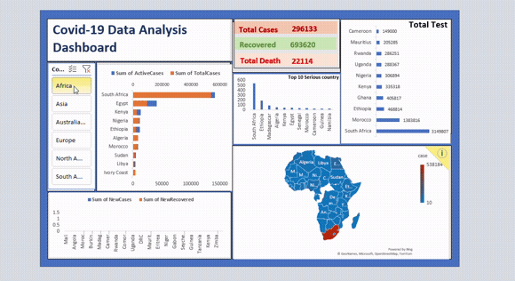
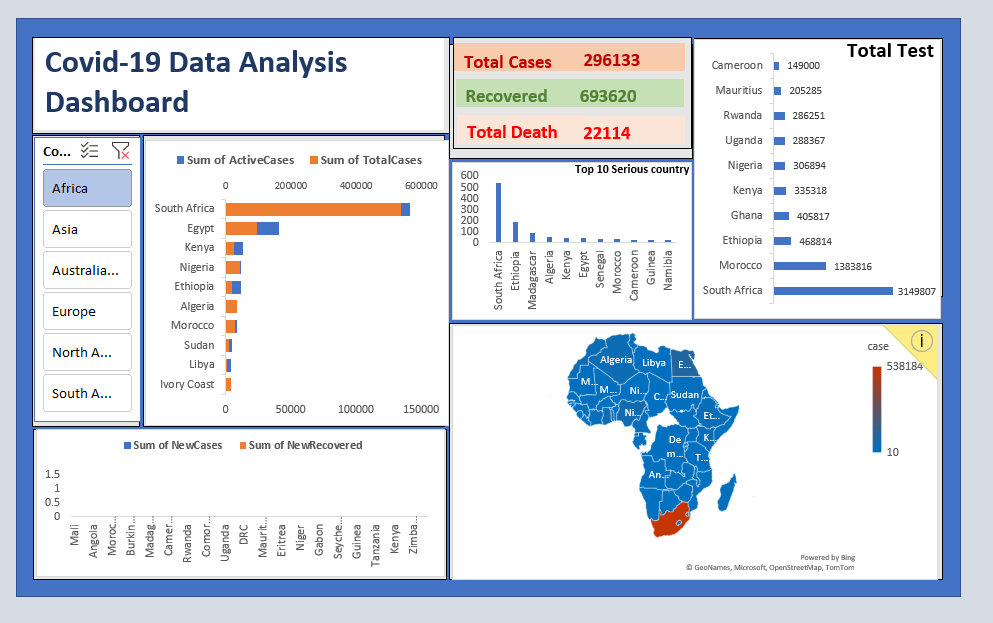

# 🦠 COVID-19 Analysis Dashboard | Microsoft Excel

An interactive **COVID-19 Analysis Dashboard** built in **Microsoft Excel** to visualize and analyze COVID-19 data using Pivot Tables, Pivot Charts, Slicers, and KPI cards. The dashboard enables users to explore trends, compare statistics, and gain insights through an easy-to-use interactive interface.

---

## 📌 Project Overview

This dashboard transforms raw COVID-19 data into meaningful visual insights. It provides an interactive way to monitor cases, deaths, recoveries, and other key metrics using Excel's built-in Business Intelligence features.

---

## 🎯 Objectives

* Analyze COVID-19 data efficiently.
* Monitor key performance indicators (KPIs).
* Identify trends and patterns.
* Enable interactive filtering using slicers.
* Present data in a clean and professional dashboard.

---

## 📊 Dashboard Features

* 📌 Interactive Dashboard
* 📌 KPI Summary Cards
* 📌 Pivot Tables
* 📌 Pivot Charts
* 📌 Slicers for Dynamic Filtering
* 📌 Trend Analysis
* 📌 Data Visualization
* 📌 User-Friendly Layout

---

## 🛠 Tools & Skills Used

* Microsoft Excel
* Pivot Tables
* Pivot Charts
* Slicers
* Data Cleaning
* Data Analysis
* Dashboard Design
* Data Visualization

---

## 📁 Project Structure

```text
COVID-19-Analysis-Dashboard/
│
├── COVID Analysis-Dashboard.xlsx
├── README.md
├── assets/
│   ├── dashboard-preview.png
│   └── dashboard-demo.gif
```

---

🎥 Dashboard
<p align="center">  </p>

📸 Dashboard Preview
<p align="center">  </p>


## 📈 Key Insights

* Interactive analysis of COVID-19 statistics.
* Easy comparison using filters and slicers.
* Dynamic visualizations for better decision-making.
* Professional dashboard suitable for portfolio projects.

---

## 🚀 How to Use

1. Download the Excel workbook.
2. Open it in Microsoft Excel (2019 or Microsoft 365 recommended).
3. Enable editing if prompted.
4. Use the slicers to interact with the dashboard.
5. Explore charts and KPIs for insights.

---

## 💡 Learning Outcomes

This project demonstrates practical skills in:

* Excel Dashboard Development
* Business Intelligence
* Data Visualization
* Data Analysis
* Interactive Reporting

---

## 👩‍💻 Author

**Mehwish Akram**

* Data Analyst
* MIS Administrator
* Business Analyst
* Marketing Executive

---

## ⭐ If you like this project

Please consider giving this repository a **Star ⭐**.
